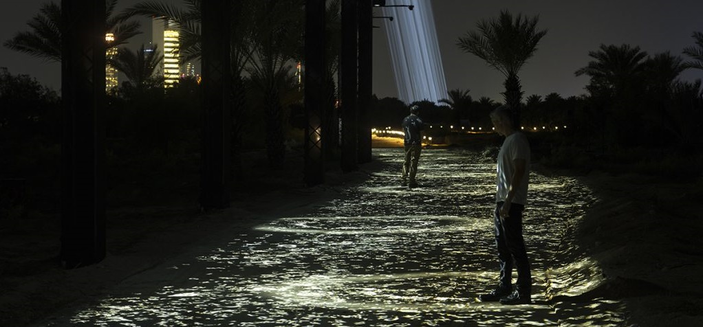

# CONFÉRENCE - Gestion de collection et mise en exposition d'une oeuvre
*Mardi 16 avril 2024 - 12h30-14h00*

La conférence mettait en lumière le fonctionnement d'une exposition, plus précisément comment la documentation est effectuée ainsi que sa mise en exposition. La conférencière, Jade Séguela, joue un rôle crucial dans ce cheminement. En effet, cette dernière est registraire pour l'artiste Rafael Lozano-Hemmer.

--------------------------------------------------

**Présentation de l'intervenante**

Jade Séguela détient un Diplôme d'Études Collégiales en Arts et Lettres, avec spécialisation en multimédia, suivi d'un Bachelor of Fine Arts. Elle a aussi une Maîtrise en Muséologie, approfondissant ainsi ses compétences dans la gestion et la documentation des œuvres artistiques.

**L'équipe derrière**

Rafael Lozano Hemmer n'est pas tout seul; derrière lui, il y a le Studio Antimodar. Plusieurs personnes, dont Jade, coopèrent pour la réalisation des œuvres, par exemple, une équipe de gestion, organisée en quatre "sous-équipes" : R&D, PRODUCTION, LEGACY et EXHIBITION.

**La documentation**

La conférencière a souligné l'importance de la documentation dans les expositions. En effet, Jade se charge de documenter chaque composante d'une présentation avant son envoi. Cette étape est cruciale puisque les expositions se font mondialement, donc cette pratique aide à la compréhension au sein de l'équipe, agit comme preuve pour les douanes, et aussi pour les archives. La conférencière présente cette technique comme étant des "Beauty Shots" pour les photos, ou des "Packing Lists" pour les documents Excel.

**Translation Steam**

> Photo de Translation Stream un parcours lumineux interactif à Abu Dhabi, United Arab Emirates
> 
> **Source** Photo de Lance Gerber à *Translation Island: Translation Stream*, Manar Abu Dhabi 2023

Les points apportés par Jade se sont montrés encore plus importants, surtout lors d'une des expositions de Rafael Lozano-Hemmer, soit Translation Stream. En effet, étant localisée à Abu Dhabi, une équipe pour réaliser cette œuvre est mise en place afin de penser et surpasser certains enjeux techniques, comme dans ce cas-ci, les conditions météorologiques, le manque d'électricité et le fait d'être tout simplement dans un autre pays. La documentation était aussi primordiale pour le transport et l'installation.

--------------------------------------------------

La conférence était très intéressante, puisque nous pouvions vraiment voir l'envers du décor d'une exposition. Dans la plupart des musées, les visiteurs ne sont pas, ou du moins très peu, informés sur la mise en exposition d'une œuvre. De vraiment connaître les différents processus de création, de documentation ainsi que d'installation est tout simplement fascinant.

