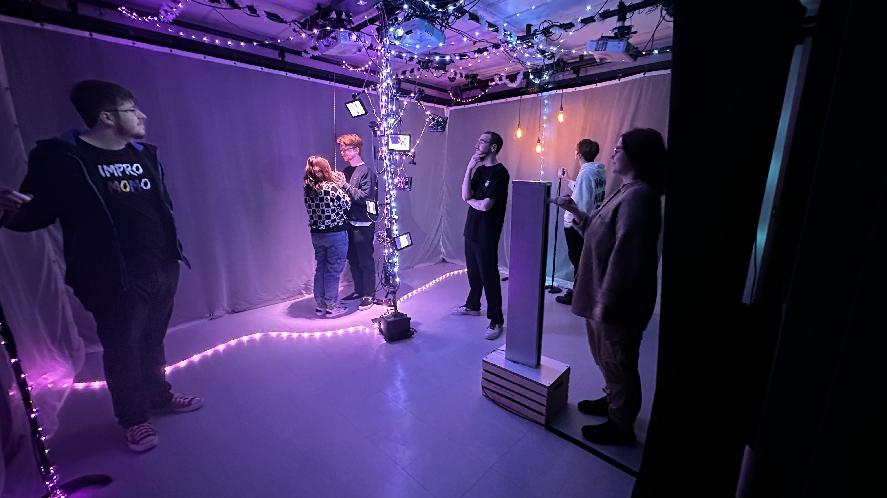
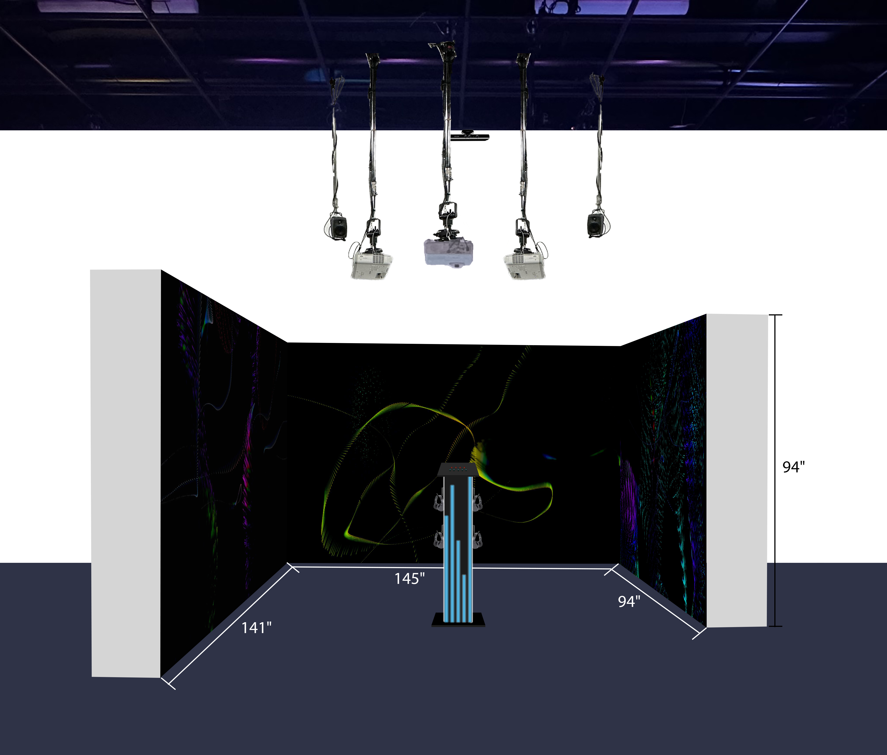

# Exploration des projets par les étudiants de 3e année en TIM

[!(https://i9.ytimg.com/vi_webp/-yphrLrtkEo/mq2.webp?sqp=CJTLrLEG&rs=AOn4CLBbHDzrYfvDgpkE4YKQNd7VeodjJA)](https://www.youtube.com/watch?v=-yphrLrtkEo)

**Crescentia**, qui signifie *« croissance »* en latin, met de l'avant le concept d'évolution qui apparaît sous plusieurs facettes, que ce soit de manière organique, environnementale, ou encore psychologique. C'est aussi le nom de l'exposition finale des étudiants en techniques d'intégration multimédia du Collège Montmorency dont les œuvres explorent ce concept de plusieurs manières. Ce sont des créations en perpétuel mouvement, qui évoluent et se transforment au gré des actions des visiteurs.

**Source** Crescentia | TIM Montmorency 2024 | <https://tim-montmorency.com/2024/projets/>
 
## RHIZOMATIQUE
*Jolyanne Desjardins, Maïka Désy, Laurie Houde, Felix Testa Radovanovic*

<https://youtu.be/JO0JnrtgMJs?si=jsxUxty9pMKRH7nj>

**Résumé du projet :**
> Rhizomatique est une oeuvre intéractive qui relie l'humain et le temps. Dans ce projet, en appuyant sur la toile l'interacteur naviguera dans le cerveau pour y découvrir ses souvenirs, qui vont par la suite être révellés sur les projections immersives.

Cette oeuvre a pour but de faire oublier au spectateur le temps, et de "revivre" des souvenirs qui ne lui appartiennent pas. Rhizomatique 
aborde alors plus le thème de l'évolution psychologique, illustrant la création et la perte des souvenirs à travers le temps.

Comme illustrer ci-contre, l'équipe, du nom de *Celestia*, ont disposé leur projet devant un ciclorama, afin d'optimiser la projection. Ils ont de plus eu recours à de nombreux projecteurs et hauts-parleurs (3) afin de réaliser le sentiment d'immersion, élément primordial à l'oeuvre. De plus, ils ont utilisé un podium muni d'une toile afin de rendre la projection interactive, augmentant l'expérience du spectateur.

Le sentiment recherché pour cette exposition est très bien ressentis: le spectateur devient nostalgique et réfléchis sur l'impact du temps sur nos vie.

**Source** Crescentia | TIM Montmorency 2024 | [https://tim-montmorency.com/2024/projets/Rhizomatique/docs/web/index.html/](https://tim-montmorency.com/2024/projets/Rhizomatique/docs/web/index.html)

-----------------------------------------------------------------------------------------------------------------------------------------------------

## EFFET PAPILLON
*Raphaël Dumont, Alexis Bolduc, William Morel, Alexia (Ryan) Papanikolaou, Viktor Zhuravlev, Jasmine Lapierre*
 
<https://youtu.be/yFEkb-21T4E?si=KnTQHPnt6UxmudYS>

**Résumé du projet :**
> Une installation interactive immersive qui explore le cycle de vie d'un pommier tout en mettant en lumière l'effet papillon à travers des éléments électroniques. L'interacteur est invité à participer à une expérience sensorielle et éducative qui souligne la notion complexe de l'effet papillon.

**Source** Crescentia | TIM Montmorency 2024 | <https://tim-montmorency.com/2024/projets/Effet-Papillon/docs/web/index.html/>

Dans cette installation interactive, le but est de conscientiser le spectateur à l'impact des gestes du quotien, ainsi qu'à leurs répercusions. L'oeuvre est représentée sous le thème organique, mais le message s'applique dans chaque aspect de la vie, tant sur le plan écologique que social.

Effet Papillon se déroule dans un petit studio, où le spectateur peut vivre l'expérience en 360 degrés, et peut même se déplacer afin de voir l'expositon sius plusieurs angles de vues différents. Le studio est composé de multiples hauts-parleurs, projecteurs et girlandes de lumières et aussi d'une "pôle" où y sont accrochés plusieurs petits écrans. Trois "stations" permet l’interaction entre l'exposition et le spectateur, afin de faire progresser l'oeuvre.

L'expérience du spectateur est très bonifiée, principalement en raison des dispositifs qui font avancer l'exposition. De plus, la petite pièce permet de vraiement "entrer" dans l'univers de l'oeuvre, et d'être totalement immergé.

-----------------------------------------------------------------------------------------------------------------------------------------------------

## KIGO
*Érick Ouellette, William Rathier Mailly, Gabriel Clerval, Nicolas St-Martin, Antoine Dion*

<https://youtu.be/WNcLQIxaG8I?si=qKjmMFCGwngvfXYN>

**Résumé du projet :**
> Un jeu interactif oû l'interacteur doit éviter des obstacles dans un univers inspiré du style visuel néon rétro, dans lequel l'esthétique changera pour s'associer aux quatres saisons.

Contrairement aux projets présentés plus haut, KIGO se concentre davantage sur le plan de la progression psychologique ressentis lors que l'on joue à un jeux. Leur concept ressemble à celui d'un jeux vidéo de réalité augmentée, notament par le suivis des mouvements du spectateur. 

Comme on peut l'obersver ci-contre, le plan est de vue aérienne. L'espace pour la mise en expostion est relativement grand, ce qui favorise le déplacement, un important détail puisque que l'oeuvre dépend justement des mouvements du spectateur. Deux kinets sont disposés en avant et aussi en arrière du spectateur afin de bien capter les mouvements de ce dernier. Les hauts-parleurs et la projection murale est bien sur aussi importants afin de rendre l'expérience possible et agréable.

L'expérience est définitivement amusante et réaliste, en plus d'avoir une touche de futurisme apporter par le côté artistique de l'oeuvre.

 
**Source** Crescentia | TIM Montmorency 2024 | <https://tim-montmorency.com/2024/projets/Kigo/docs/web/index.html/>

-----------------------------------------------------------------------------------------------------------------------------------------------------

## SONALUX
*Antoine Haddadm, Camélie Laprise, Ghita Alaoui, Vincent Desjardins*

<https://youtu.be/s5icQgM7LLg?si=NQeBM-8Zhd1KC-FI>

**Résumé du projet :**
> Sonalux est une installation qui dépasse les limites du réel pour proposer un monde d'art génératif où la notion du temps est repensé dans une boucle laissant place à un voyage astral collectif. L'interacteur se voit projeter dans un espace sans contraintes où il en devient le maître par la maîtrise des pièces d'instruments qui se trouvent sur le podium.

Complètement à l’opposé des projets différents, SONALUX présente une expérience hors du commun. En effet, le concept est abstrait et vise beaucoup plus sur l'emotion du spectateur que d'un message précis. Il s'agit pour cette oeuvre d'un environement en constante évolution, tant pas l'aspect sonore et visuelle. 

Malgré la petite dimension dans laquelle se déroule l’exposition, tout est réfléchis pour un disposition optimale. Au centre de la représentation d'un studio se trouve un podium où des lumières y sont accrochées. Celles-ci réagissent à l’intensité du volume qui peut varier lorsque le spectateur rotation des boutons au somment du podium. Des projecteurs et toujours des haut-parleurs sont présents pour entrer dans ce que l'équipe appelle "voyage austral". 

Les murs montés sont non-seulement présents pour séparer SONALUX des autres oeuvres, mais réussit à ressembler les différents spectateurs et créer un effet de collectivité, tout en gardant une légère intimité.

L'émotion est présente à mille pourcent dans ce genre d'oeuvre, où le spectateur peut non seulement regarder, écouter, en plus d'intéragir avec les boutons, pour modifier les effets sonores ainsi que la vitesse et le genre d'animations projetés sur les murs. Puisqu'il n'y a pas de message concret, cet à chacun d'établir sa vision et son expérience, ce qui fait de cette oeuvre une 

**Source** Crescentia | TIM Montmorency 2024 | <https://tim-montmorency.com/2024/projets/Sonalux/docs/web/index.html/>

-----------------------------------------------------------------------------------------------------------------------------------------------------

## CANEVAS COSMIQUE
*Jacob Alarie-Brousseau, Étienne Charron, Jérémy Cholette, Quoc Huy Do, Mikaël Tourangeau*

<https://youtu.be/Jrn4U27G5YY?si=MfrmAX8dsl1ZxOk9>

**Résumé du projet :**
> L'interacteur se retrouve devant une table, où se trouve une simulation d'un système solaire avec laquelle il peut intéragir en déposant des statues déclancheant différents phénomènes. L'interacteur est invité à expérimenter sur cette table.

Pour cette dernière oeuvre, l'équipe *Des gars de la table* ont voulu recréer un scnénario où le spectateur peut intéragir avec son environnement au moyen d'objets connectés. Le thème de cette ouevre est l'espace et rejoins celui de Crescentia par la définition d'évolution, puisque l'espace est en constante évolution.

Comme le shéma de plantation le démontre, la mise en exposition de l'oeuvre est relativement simple; elle comporte principalement une table munie de **kinects**, de deux hauts-parleur et d'un projecteur. 

L'expositon est vraiment axé sur l'experimentation. Le spectateur est invité à toucher, manipuler et fusionner les petites statues afin de créer un changement sur la projection. Il n'y pas de messages concrets ou de leçon spécifique au Canevas Cosmique, seulement de faire vivre au spectateur un bon moment par le moyen de l’interactivité..

**Source** Crescentia | TIM Montmorency 2024 | <https://tim-montmorency.com/2024/projets/Canevas-Cosmique/docs/web/index.html/>

-----------------------------------------------------------------------------------------------------------------------------------------------------

## **RETOUR SUR LES PROJETS**

Afin de réaliser ce genre de projet, il est essentiel d'avoir suivis le cours d'**Interactivité ludique** *(offert en troisième session)*, **Objets interactifs** *(offert en cinquième session)* ainsi que **Conception d’une expérience multimédia** *(offert en cinquième session)*.

En effet, les étudiants de 3e année en TIM ont dû commencés par la base, c'est-à-dire par le cours d'**Interactivité ludique**. Ce cours introduit les logiciels d’intégration multimédia et transmet aux étudiants les notions de base de l’interactivité.

Par la suite, le cours d'**Objets interactifs** est lui aussi incontournable pour la réalisation de ce projet puisqu'il permet de se familiariser avec des technologies électroniques (vus dans les projets des étudiants) et les intégrer à un système multimédia interactif.

Finalement, le cours de **Conception d’une expérience multimédia** est évidement indispensable puisqu'il s'agit non seulement de mettre en application les éléments appris, mais en plus de rajouter un aprocessus d’idéation, une l’analyse du scénario et du scénarimage, à son adaptation, à la planification des besoins en ressources humaines et techniques et à la vérification de sa faisabilité technique.

-----------------------------------------------------------------------------------------------------------------------------------------------------

Lors de l'exploration des projets, j'ai pu en apprendre davantages sur les **potentimoètres**.

En effet, cette composante est un type de résistance variable qui permet de receuillir une tension. Dans le cadre des projets, les potentiomètres utilisés étaient numériques, c'est-à-dire que sa résistance ne varie pas de façon mécanique, mais en fonction d'une valeur numérique qu'il reçoit. Il assure l'interaction avec l'utilisateur.

Les applications de vidéos et de traitement de sons utilisées dans les projets des troisièmes possèdent des potentiomètres, permettant le control des divers paramètres relatifs au son (volume, fréquence, etc.).

-----------------------------------------------------------------------------------------------------------------------------------------------------

## **PRÉFÉRENCE ACTUELLE**

Si je devais classer en ordre d'appréciation les projets, j'irais comme suis:

- SONALUX
- RHIZOMATIQUE
- EFFET PAPILLON
- KIGO
- CANEVAS COSMIQUE

En effet, **SONALUX** détient la première position puisque celle avec celle-ci que j'ai réellement "connecté". Le concept derrière est puissant, tout en étant simple, et l'équipe à su l'aborder avec brio. De plus, l'expérience est magique, tant par la musique que par le visuel. J'ai également apprécié le côté plus intime de la mise en expostion, et le fait qu'on ressentait à fond l'immersion en raion des écouteurs. Finalement, l'aspect d'interaction était au rendez-vous, non seuleument pour changer la musique, mais aussi les vidéos projetées et aussi la luminosité de certaines lumières.

Il est vrai qu'à ma première visite, j'ai rapidement sauter cette exposition puisque rien n'était réelement actif, et l'équipe était en cours de création de l'exposition. Je pense que c'est peut-être pour cela que j'ai tant su apprécier l'oeuvre finale puisque j'ai pu remarquer la différence entre mes deux visites et le travail derrière. À prioris, l'expérience semble relativement banale, mais tout comme moi, les spectateurs sont attirés et curieux de voir et entendre ce que **SONALUX** a à nous présenter. C'est vraiment lorsque nous sommes en expériementation et qu'on s'immerge dans l'exposition que l'expérience commence vraiment.

-----------------------------------------------------------------------------------------------------------------------------------------------------

J'ai également très aimé **RHIZOMATIQUE**, pour son côté un peu abstrait comme dans **SONALUX**. Tout comme cette dernière, l'oeuvre était très bien exécuté; le message était fort et l'immersion était très présente.

-----------------------------------------------------------------------------------------------------------------------------------------------------

J'ai aussi aimé **EFFET PAPILLON** pour son immersion total et la créativité, mais j'ai trouver l'exposition un peu chargée, et, à mes dernière visite, des problèmes techniques ressortaient encore, gachant évidement l’expérience.

-----------------------------------------------------------------------------------------------------------------------------------------------------

Finalement, je classe **KIGO** en avant-dernière position, puisque j'ai aimé le concept, mais je trouvais qu'il manquait de profondeur à l'oeuvre, de l'expérience. Même chose pour **CANEVAS COSMIQUE**, qui n'était pas très immersif.

-----------------------------------------------------------------------------------------------------------------------------------------------------

LES CRÉATIONS ONT ÉTÉ RÉALISÉES DANS LE CADRE DU COURS *EXPÉRIENCE MULTIMÉDIA INTERACTIVE*, ENSEIGNÉS PAR GUILLAUME ARSENEAULT ET THOMAS OEULLET FREDERICKS
