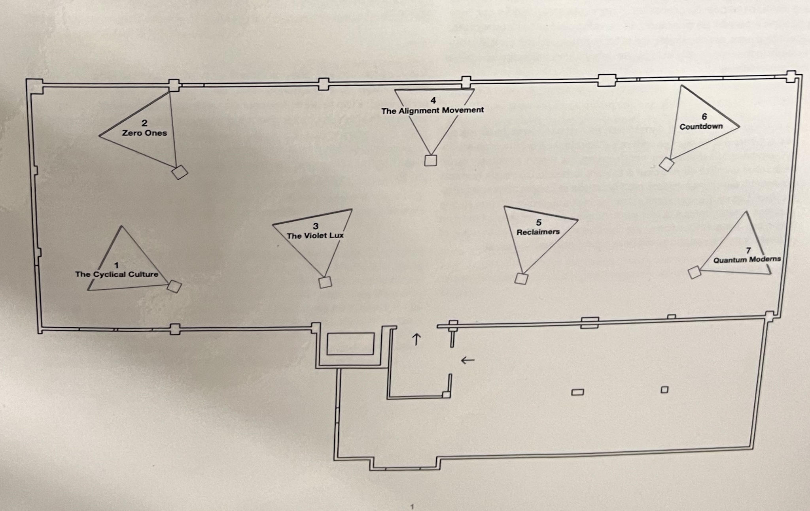
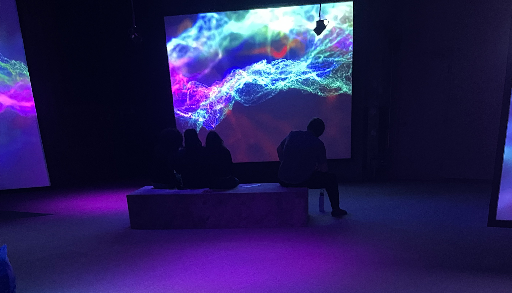
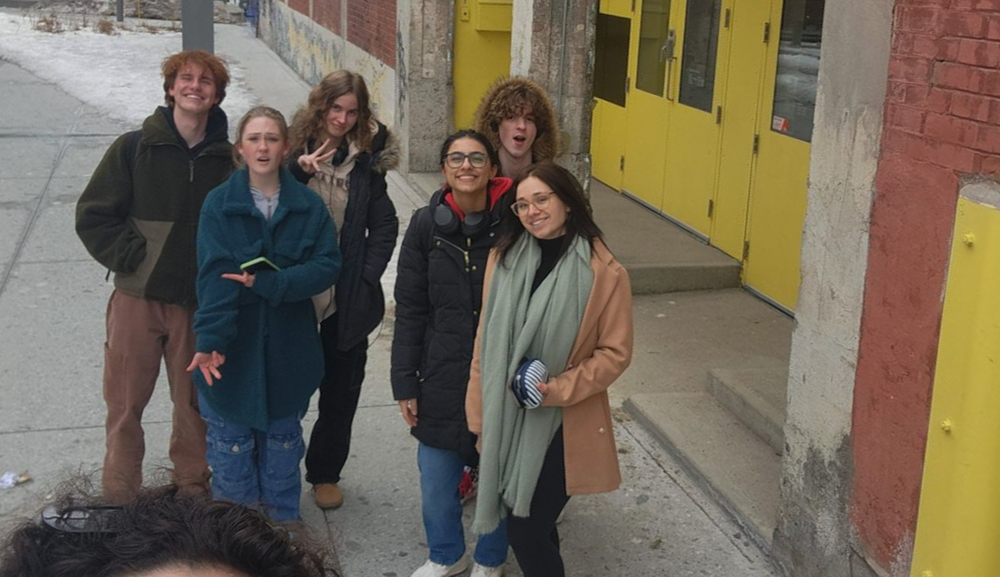

# Jeremy Shaw : *PHASE SHIFTING INDEX*

> **Source** Photo de moi à l'installation de Jeremy Shaw, *PHASE SHIFTING INDEX*, Fonderie Darling, 02/02/2024

Située à la Fonderie Darling, *PHASE SHIFTING INDEX* est une exposition itinérante réalisée en 2020. Elle est présentée par le Musée d’art contemporain de Montréal en partenariat avec The Polygon,Vancouver

> **Source** Photos de moi à devant la Fonderie Darling, 745 Rue Ottawa, Montréal, 02/02/2024

## L'artiste
Jeremy Shaw est un artiste né en 1977 à North Vancouver. Il est reconnu pour ces divers techniques afin d'explorer le sentiment de spiritualité, de conscience supérieure lors de pratiques culturelles ou d’expériences personnelles. Shaw utilise régulièrement un aspect documentaire, tout en mélangeant les époques.

Shaw a notamment présenté ces création au *Centre Pompidou* à Paris, au *MoMA PS1* à New York, au *Schinkel Pavillon* à Berlin, au *Tate Modern* à Londres, au *Musée des beaux-arts du Canada* à Ottawa, et au *Sammlung zeitgenössische Kunst des Bundesrepublik* en Allemagne.

> **Source** Site Web du MAC *Jeremy Shaw : Phase Shifting Index* <https://macm.org/expositions/jeremy-shaw/>

## Analyse descriptive de l'œuvre 
*PHASE SHIFTING INDEX* installation immersive combine vidéo, son et lumière à partir de sept films VHS, 16mm et Hi-8 de différentes époques, afin de plonger le visiteur dans une boucle temporelle, et ce, à l'aide de multiples phases.
### Mise en place de l'œuvre
Sept écrans sont disposés de façon à pouvoir naviguer autour. Deux d'entre eux ont même une toile transparente pour donner la possibilité de visioner les courts-métrages des deux bords. Ces écrans font face à des bancs, certains petits et à proximité des toiles, et les autres sur le long du mur, de type gradins afin d'obtnenir une meilleure vue d'ensemble de l’exposition.

> **Source** Documentation en lien avec l'œuvre, Jeremy Shaw, *PHASE SHIFTING INDEX*, Fonderie Darling

> **Source** Musée d'art contemporain de Montréal, Jeremy Shaw, *PHASE SHIFTING INDEX*, Fonderie Darling <https://macm.org/expositions/jeremy-shaw/>

### Composantes et techniques
- [ ] toiles blanches opaques et transparentes
- [ ] projecteurs
- [ ] haut-parleurs
- [ ] lumières
- [ ] console

### Éléments nécessaires à la mise en exposition
Il est primordial pour l'exposition d'avoir un plafon ouvert afin d'y accrocher les diverses composantes techniques telles qu’énumérées ci-haut

> **Source** Photo de moi à l'installation de Jeremy Shaw, *PHASE SHIFTING INDEX*, Fonderie Darling, 02/02/2024

## Signification de l'œuvre et son contexte

> **Source** Photo de moi à l'installation de Jeremy Shaw, *PHASE SHIFTING INDEX*, Fonderie Darling, 02/02/2024

## Expérience vécue
Les spectateurs sont invités à se promener et à s’arrêter devant les divers écrans. Les bancs placés encourage le visionnement assis, afin de vraiment donner toute son attention.

### Ce qui m'a plu ♥
J'ai aimé le mélange de la technologie et de la spiritualité. En effet, l'exposition Phase Shifting Index était riche en sensation et m'a fait ressentir un mélange d'émotions contradictoires tel que la confusion totale combinée avec une sorte de sentiment de calme profond. Au départ, la confusion puisque, comme mentionné plus haut, les spectateurs sont invités à se promener et à s’arrêter devant les vidéos qui sont dans des langues incompréhensibles. Ce sentiment s'aggrandit lorsque le volume de chaque reportage monte en intensité. Je me souviens d'avoir été envahie d'une sensation lourde et quelque peu désagréable. Et puis, tout d'un coup, alors que l'on comprend que les vidéos sont liées et se synchronises pour transformer le sentiment "d’étouffement" en satisfaction. Finalement, le sentiment de calme absolu lorsque tout devient calme, accompagné de lumières et d'une douce mélodie. 

Ce cheminement d'émotion est ce qui m'a le plus connecté à l'œuvre ♥ . Voici le moment en question:

> **Source** Photo de moi à l'installation de Jeremy Shaw, *PHASE SHIFTING INDEX*, Fonderie Darling, 02/02/2024

### Aspect que je ne souhaites pas retenir pour mes propres créations ♦
Quoique j'ai adoré le sentiment d’incompréhension, et que, selon moi, il est nécessaire pour pouvoir ressentir ce sentiement de calme et de paix d'esprit, j'aurais aimé un peu plus d'indications, de directions. Cela peut s'implement être par l'ajout d'un tracé pour établir une sorte de parcour à travers les écrans. En effet, lorsque je suis aller à l'exposition, je n'ai pas pu voir toutes les vidéos avant que le *grand moment* arrive, ce qui m'a un peu déçue puisque je n'ai pas eu la chance de voir l'œuvre dans son ensemble en premier.

## Jeremy Shaw : PHASE SHIFTING INDEX, Fiche d'œuvre

> **Source** Photo de moi à la Fonderie Darling, 02/02/2024
