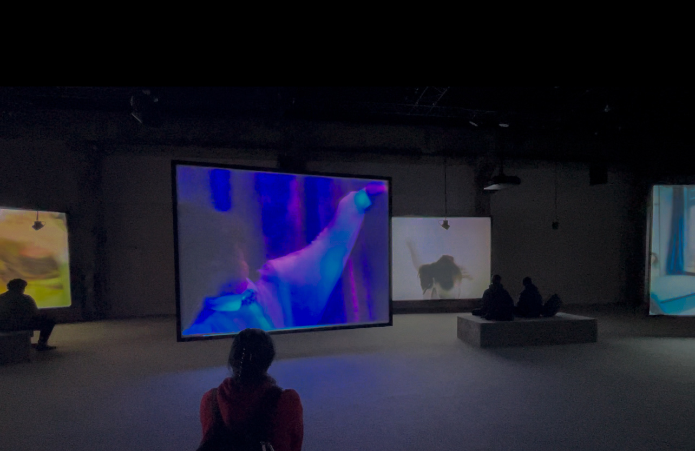
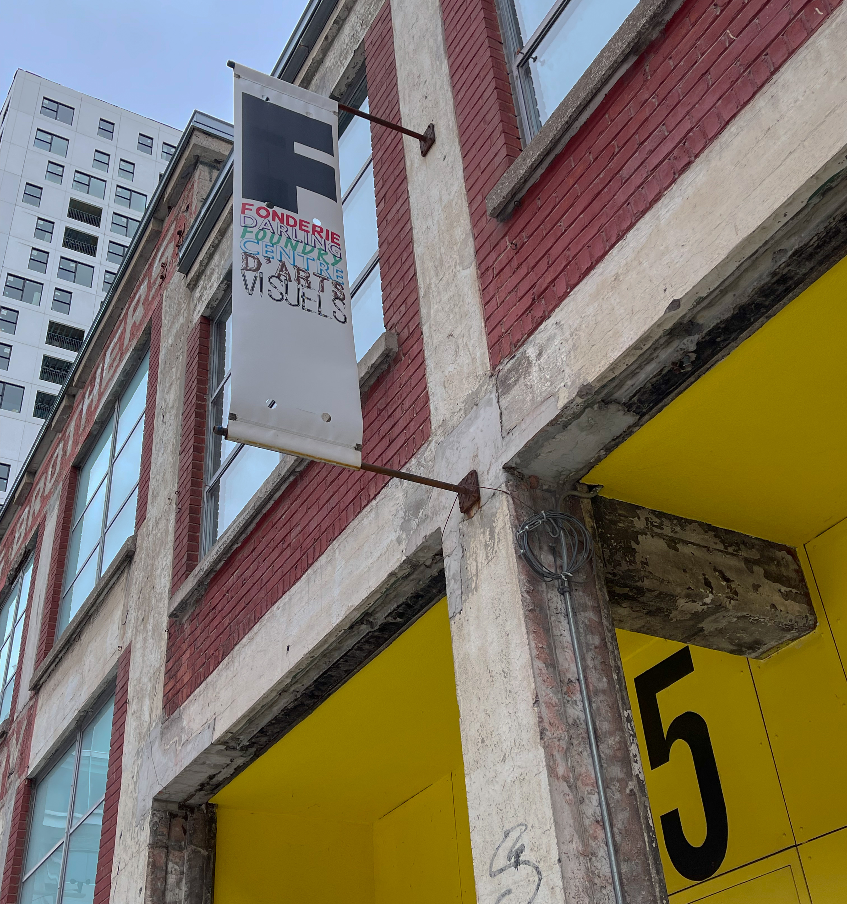
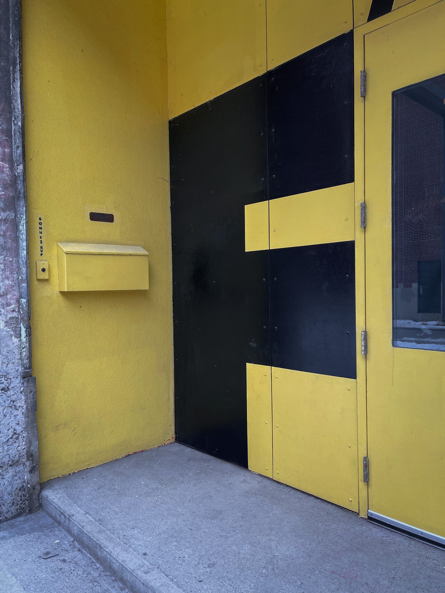
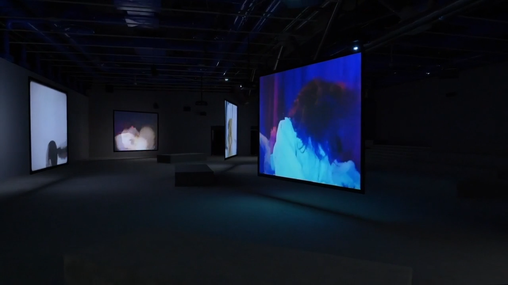
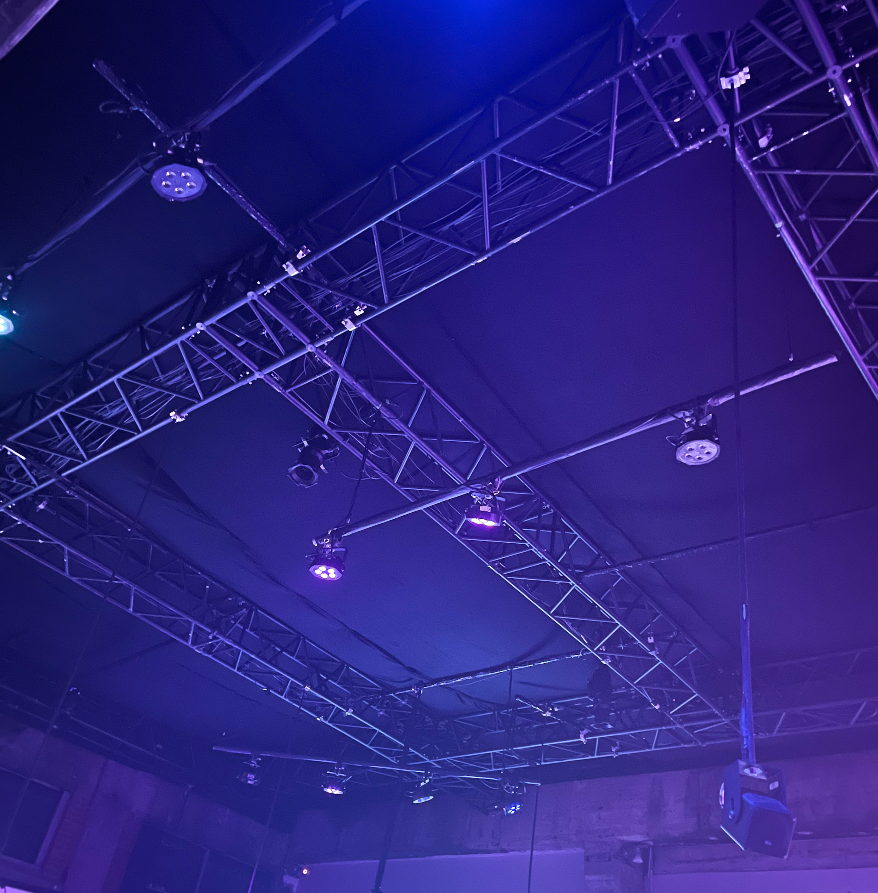
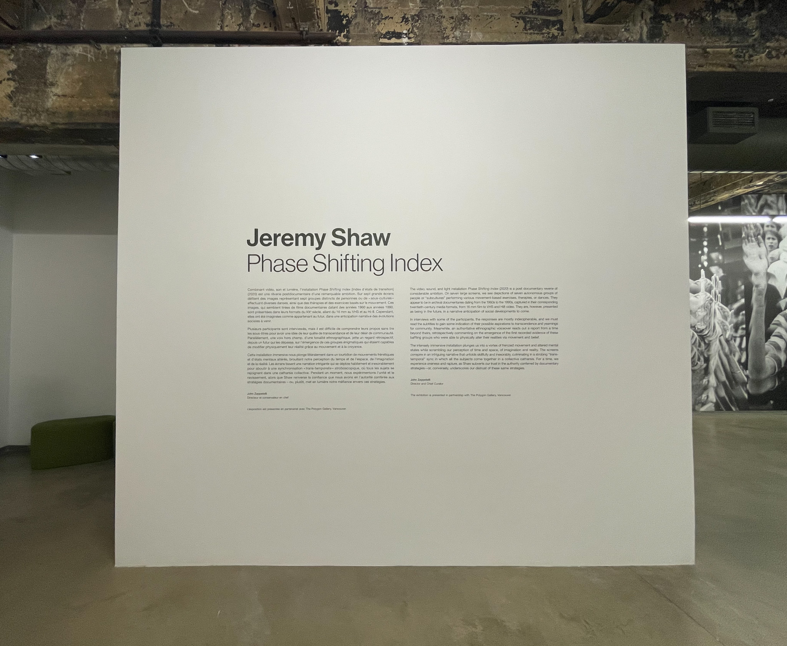

# Jeremy Shaw : *PHASE SHIFTING INDEX*

> **Source** Photo de moi à l'installation de Jeremy Shaw, *PHASE SHIFTING INDEX*, Fonderie Darling, 02/02/2024

Située à la Fonderie Darling, *PHASE SHIFTING INDEX* est une exposition itinérante réalisée en 2020. Elle est présentée par le Musée d’art contemporain de Montréal en partenariat avec The Polygon,Vancouver

> **Source** Photos de moi à devant la Fonderie Darling, 745 Rue Ottawa, Montréal, 02/02/2024

## L'artiste
Jeremy Shaw est un artiste né en 1977 à North Vancouver. Il est reconnu pour ces divers techniques afin d'explorer le sentiment de spiritualité, de conscience supérieure lors de pratiques culturelles ou d’expériences personnelles. Shaw utilise régulièrement un aspect documentaire, tout en mélangeant les époques.

Shaw a notamment présenté ces création au *Centre Pompidou* à Paris, au *MoMA PS1* à New York, au *Schinkel Pavillon* à Berlin, au *Tate Modern* à Londres, au *Musée des beaux-arts du Canada* à Ottawa, et au *Sammlung zeitgenössische Kunst des Bundesrepublik* en Allemagne.

> **Source** Site Web du MAC *Jeremy Shaw : Phase Shifting Index* <https://macm.org/expositions/jeremy-shaw/>

## Analyse descriptive de l'œuvre 
*PHASE SHIFTING INDEX* installation immersive combine vidéo, son et lumière à partir de sept films VHS, 16mm et Hi-8 de différentes époques, afin de plonger le visiteur dans une boucle temporelle, et ce, à l'aide de multiples phases.
### Mise en place de l'œuvre
Sept écrans sont disposés de façon à pouvoir naviguer autour. Deux d'entre eux ont même une toile transparente pour donner la possibilité de visioner les courts-métrages des deux bords. Ces écrans font face à des bancs, certains petits et à proximité des toiles, et les autres sur le long du mur, de type gradins afin d'obtnenir une meilleure vue d'ensemble de l’exposition.

> **Source** Musée d'art contemporain de Montréal, Jeremy Shaw, *PHASE SHIFTING INDEX*, Fonderie Darling <https://macm.org/expositions/jeremy-shaw/>

### Composantes et techniques
- [ ] toiles blanches opaques et transparentes
- [ ] projecteurs
- [ ] haut-parleurs
- [ ] lumières
- [ ] console

### Éléments nécessaires à la mise en exposition
Il est primordial pour l'exposition d'avoir un plafon ouvert afin d'y accrocher les diverses composantes techniques telles qu’énumérées ci-haut

> **Source** Photo de moi à l'installation de Jeremy Shaw, *PHASE SHIFTING INDEX*, Fonderie Darling, 02/02/2024

## Signification de l'œuvre et son contexte

> **Source** Photo de moi à l'installation de Jeremy Shaw, *PHASE SHIFTING INDEX*, Fonderie Darling, 02/02/2024

## Expérience vécue

### Ce qui m'a plu ♥
J'ai aimé le mélange de la technologie et de la spiritualité. En effet, l'exposition Phase Shifting Index était riche en sensation et m'a fait ressentir un mélange d'émotions contradictoires tel que la confusion totale combinée avec une sorte de sentiment de calme profond.

### Aspect que je ne souhaites pas retenir pour mes propres créations ♦

### NOTES ET PHOTOGRAPHIES LORS DE VOTRE VISITE

|:pencil2: Information recherchée  | :camera: Appui visuel à intégrer | Détails supplémentaires |
| ---     | ---             | --- |
| Nom de l'exposition ou de l'événement : Jeremy Shaw : Phase Shifting Index |Affiche de l'exposition| |
| Lieu de l'exposition : Fonderie Darling | Vous devant l'entrée de l'édifice|  |
| Type d'exposition : itinérante |  |  |
| Date de visite : 02/02/2024  |            |  |
| Titre de l'œuvre : Phase Shifting Index | Vue d'ensemble de l'oeuvre ou du dispositif  |  |
| Nom de l'artiste : Jeremy Shaw |         |  |
| Année de réalisation : 2020  |          |  |
| Description de l'oeuvre : Cette installation immersive combine vidéo, son et lumière à partir de sept films VHS, 16mm et Hi-8 de différentes époques, afin de plonger le visiteur dans une boucle temporelle, et ce, à l'aide de multiples phases| Cartel + diverses vues          | À composer ou reprendre la descritpion offerte sur le site de l'artiste ou sur le cartel en **indiquant bien sa source** |
| Type d'installation : immersive | Vue *parlante* - vidéo ou photo qui nous permet de bien comprendre le type d'installation             | --- |
| Mise en espace : Sept écrans disposés de façon non conditionnels font face à des bancs, aussi accotés au mur de la salle d'exposition | Vue d'ensemble de la pièce + croquis de la mise en espace (plan ou élévation selon ce qui facilite la compréhension, avec dimensions)        | Texte qui permet de comprendre comment l'oeuvre est mise en espace : dans quelle pièce, sur quel mur, quel est l'espace occupé, comment est-elle disposée... ?  |
| Composantes et techniques : toiles blanches opaques et transparentes, projecteurs, haut-parleurs, lumières, console | Parties composantes de l'oeuvre (il est possible d'utiliser des images tirées de sites internet pour faciliter la compréhension si les photos prises ne sont pas claires) | Liste des composantes et techniques utilisées (ce que l'artiste a fait - pensez à ce qui doit voyager dans une caisse de transport si ceci est exposé outremer) |
| Éléments nécessaires à la mise en exposition : il est primordial pour l'exposition d'avoir un plafon ouvert afin d'y accrocher les diverses composantes techniques telles qu’énumérées ci-haut | Éléments de mise en exposition (il est possible d'utiliser des images tirées de sites internet pour faciliter la compréhension si les photos prises ne sont pas claires) | Liste des éléments nécessaires à la mise en exposition (ce que le musée a mis en place pour que l'oeuvre soit exposée (bancs, cache-fil, crochets, sacs de sable, câbles, herses, projecteurs...)   |
| Expérience vécue : a faire Posture du visiteur ou gestes de l'interacteur :movie_camera: possibilité d'intégrer de courts vidéos pour documenter les actions de l'oeuvre ou l'interactivité avec celle-ci        | Texte qui explique ce qui est attendu du visiteur ou de l'interacteur. Où et comment se positionne-t-il/elle? Que faut-il faire? Comment l'oeuvre réagit-elle (si interactive)? Plus personnellement, description de l'expérience que l'oeuvre vous a fait vivre. |
| :heart: Ce qui vous a plu, vous a donné des idées : J'ai aimé le mélange de la technologie et de la spiritualité. En effet, l'exposition Phase Shifting Index était riche en sensation et m'a fait ressentir un mélange d'émotions contradictoires tel que la confusion totale combinée avec une sorte de sentiment de calme profond. | Éléments pertinents       | Texte à rédiger qui présente un ou des aspects inspirants, avec **justifications détaillées** (pourquoi est-ce que cela vous a plus/ vous a donné des idées ? |
| :thinking: Aspect que vous ne souhaiteriez pas retenir pour vos propres créations ou que vous feriez autrement : Malgré la simplicité de l'oeuvre que j'ai bie aimé, j'aurais aimé pousser encore plus à fond l’expérience d'immersion à l'aide peut-être de sièges plus sensoriels afin d'approfondir vraiemnt le visiteur dans ma création| Éléments pertinents      |Texte à rédiger qui présente un ou des aspects que vous ne retiendriez pas ou feriez autrement, avec **justifications détaillées** (pourquoi? comment?)  | 
| Références     |          |hyperliens vers les sites consultés  |
