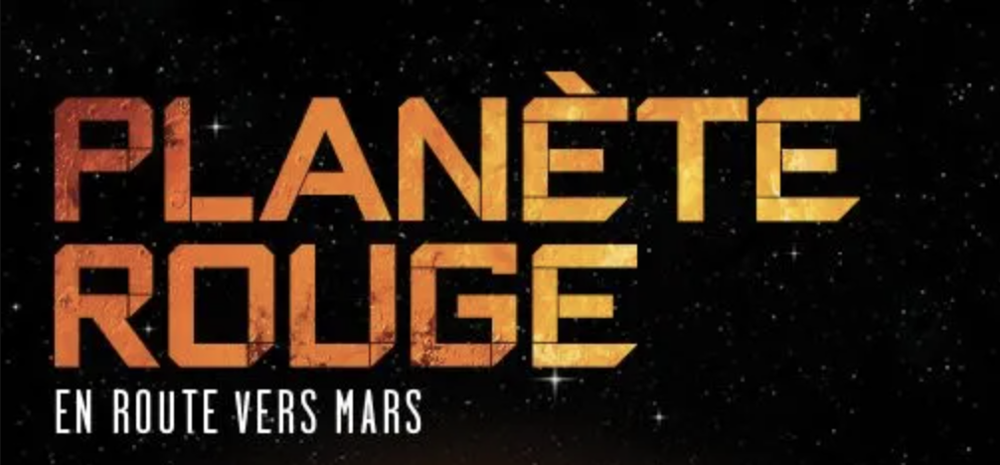

# Mission virtuelle : *La planète rouge*

> Grâce à ses trois missions virtuelles interactives inaugurées en 2012, le Cosmodôme se positionne comme « ludo-éducateur » de l’espace, qui propose l’éveil aux plaisirs de la science du Cosmos grâce à une approche basée sur les piliers expérientiels suivants : regarder, écouter, participer et vivre. Cette approche favorise l’appel aux sens et aux émotions afin de mobiliser l’attention intuitive et l’apprentissage dans un environnement immersif.
>
> **Source** Site Web du Cosmodôme https://cosmodome.org/

> Aussitôt installé dans la capsule d’un vaisseau spatial, vous vous éloignerez de la Terre à une vitesse vertigineuse. Le but de ce périple? Nul autre que la planète rouge! Seuls, à des milliards de kilomètres de la Terre, vous devrez affronter des situations imprévisibles, vous habituer à des conditions de voyage extrêmes, lutter pour préserver votre santé physique et morale et réussir des prouesses techniques inégalées. Devenez les premiers à tenter cette périlleuse odyssée vers la planète Mars!
>
> **Source** 

## Analyse descriptive de l'œuvre 

Parmis les nombreuses activités offertes au Cosmodôme, les missions virtuelles sont celles les plus appréciés. Il s'agit de trois activités interactives d'une durée d"une heure où le spectateur devient le héros d'une aventure spatiale à travers de courts métrages et de jeux interactifs.

> **Source** 

### Mise en place de l'œuvre

### Composantes et techniques
- [ ] 

> **Source** 

### Signification de l'œuvre

> **Source** 

## Expérience vécue

### Ce qui m'a plu ♥

## Mission virtuelle : La planète rouge, Fiche d'œuvre
