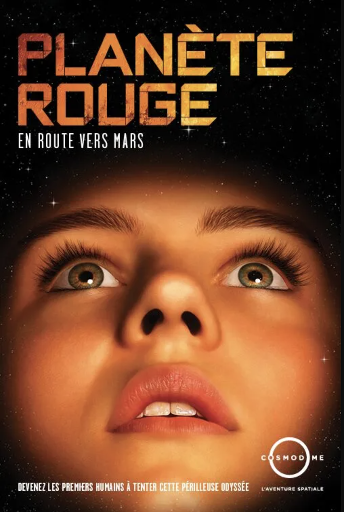
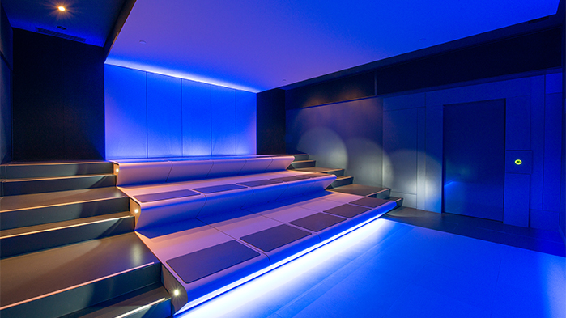
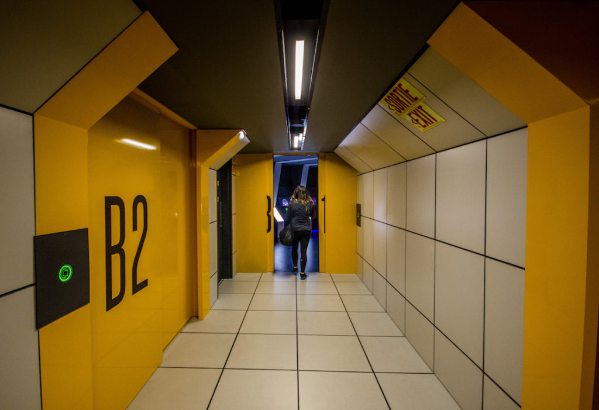

# Mission virtuelle : *La planète rouge*
## Informations sur l'oeuvre et le lieu d'exposition

- **Titre:** La planète rouge
- **Nom de la firme:** Cosmodôme
- **Année de réalisation:** 2012
- **Nom de l'exposition:** Mission virtuelle
- **Type d'exposition:** Immersive et complantative 
- **Lieu de mise en exposition:** Cosmodôme
- **Infos sur le lieu:** Inauguré en 1994, le Cosmodôme de Laval est une institution entièrement consacrée aux sciences de l’espace.
- **Date de la visite:** 01/03/2024

## Présentation détaillée de l'oeuvre

Les missions virtuelles sont des activités interactives d'une durée d"une heure où le spectateur devient le héros d'une aventure spatiale à travers de courts métrages et de jeux interactifs.

Pour la mission *La planète rouge*, le spectateur est amené à construire un camp de base, ainsi que de recueillir des informations sur la mystique planète Mars. 

- **Type d'installation:** Permanente
- **Fonction:** Transmettre la passion des sciences de l’espace et la culture scientifique
- **Mise en place de l'œuvre:** L'œuvre se déroule sur plusieurs salles, toutes reliées par des couloirs à l'allure d'un vaisseau spatial.

> **Source**

- **Composantes:**
  - écrans (certains tactiles)
  - capteurs
  - lumières
  - haut-parleurs
  - bracelets connectés

> **Source**

## Expérience vécue

## Appréciation critique et justifications
### Ce qui m'a plu ♥

Étant moi même mordu de l'espace, j'ai grandement apprécié cette mission virtuelle. L'exposition réussit grandement à piquer notre attention, nous faisant oublier le temps qui passe, un facteur que je trouve extrêmenent important. De plus, la mission La planète rouge est pour tous les âges, en plus de pouvoir se faire en petit et plus grand groupe. Il est vrai que l'exposition commence à avoir de l'âge, mais cela ne gâche point l'expérience.

> ★ La mission La planète rouge relate non seulement des évènements/missions du passé, de celles du présent, mais aussi des possibles que le future nous réserve, laissant les visiteurs se questionner et vouloir en savoir plus

### À ne pas retenir

## Liens avec autres oeuvres

**Mission virtuelle : La planète rouge, Fiche d'œuvre**
