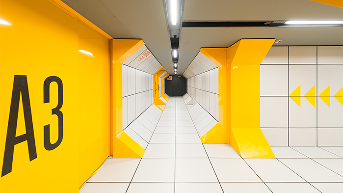

# Mission virtuelle : *La planète rouge*
## Informations sur l'oeuvre et le lieu d'exposition

- **Titre:** La planète rouge
- **Nom de la firme:** Cosmodôme
- **Année de réalisation:** 2012
- **Nom de l'exposition:** Mission virtuelle
- **Type d'exposition:** Immersive et complantative 
- **Lieu de mise en exposition:** Cosmodôme
- **Infos sur le lieu:** Inauguré en 1994, le Cosmodôme de Laval est une institution entièrement consacrée aux sciences de l’espace.
- **Date de la visite:** 01/03/2024

## Présentation détaillée de l'oeuvre

Les missions virtuelles sont des activités interactives d'une durée d"une heure où le spectateur devient le héros d'une aventure spatiale à travers de courts métrages et de jeux interactifs.Le spectateur est amené à construire un camp de base, ainsi que de recueillir des informations sur la mystique planète Mars. Le tout commence par une petite vidéo expliquative de notre mission. À la fin de celle-ci, une seconde salle s'ouvre pour poursuivre l'aventure. Pour passer de salles en salles, des bracelets connectés sont utilisés pour ouvrir les portes ainsi que pour certains jeux interactifs. Tout au long de la mission, des vidéos, des lumières et de la musique accompagne les jeux afin de vraiment rendre l'expérience immersive. La mission se termine avec une dernière vidéo qui conscientise le spectateur sur les possibilités que renferme Mars et les nombreuses avantures spatiales et celles à venir.

 

 
 
 

> **Source** VERGO, Projets / Sports et Loisirs, Salle de spectacle le Cosmodôme – Laval [https://vergo.com/fr/portfolio](https://vergo.com/fr/portfolio_page/construction-loisirs-salle-spectacle-cosmodome-laval/)

Ce genre d'exposition fût créer dans le but de transmettre la passion des sciences de l’espace et la culture scientifique

L'œuvre se déroule sur plusieurs salles, toutes reliées par des couloirs à l'allure d'un vaisseau spatial. Chaques salles qui ont pour fonction de montrer des courts métrages sont équipées de bancs pour permettre de s'assoir, tandis que celles qui sont pour les jeux sont relativement plus grande pour permettre le déplacement, en plus d'avoir des tables ou des écrans tactiles.

La mission se termine avec une dernière vidéo qui conscientise le spectateur sur les possibilités que renferme Mars et les nombreuses avantures spatiales et celles à venir.

- **Type d'installation:** Permanente
- **Fonction:** Transmettre la passion des sciences de l’espace et la culture scientifique
- **Mise en place de l'œuvre:** L'œuvre se déroule sur plusieurs salles, toutes reliées par des couloirs à l'allure d'un vaisseau spatial.
  
  
  
- **Composantes:**
  - écrans (certains tactiles)
  - capteurs
  - lumières
  - haut-parleurs
  - bracelets connectés

## Expérience vécue

**Le Cosmodome base ses missions sur les piliers expérientiels suivants:**
*regarder, écouter, participer et vivre*. 
**Cette approche favorise l’appel aux sens et aux émotions afin de mobiliser l’attention intuitive et l’apprentissage dans un environnement immersif.**

Pour ma part, j'ai adoré le mélange de vidéos et d'interactions, en plus de devoir se déplacer dans le "vaisseau", augemnter vraiment l'expérience.

## Appréciation critique et justifications
### Ce qui m'a plu ♥

Étant moi même mordu de l'espace, j'ai grandement apprécié cette mission virtuelle. L'exposition réussit grandement à piquer notre attention, nous faisant oublier le temps qui passe, un facteur que je trouve extrêmenent important. De plus, la mission La planète rouge est pour tous les âges, en plus de pouvoir se faire en petit et plus grand groupe. Il est vrai que l'exposition commence à avoir de l'âge, mais cela ne gâche point l'expérience.

> ★ La mission La planète rouge relate non seulement des évènements/missions du passé, de celles du présent, mais aussi des possibles que le future nous réserve, laissant les visiteurs se questionner et vouloir en savoir plus

### À ne pas retenir

Pour mes propres créations, je voudrais vraiment qu'il y ait plus de symbiose dans l'expérience, donc moins de "coupures". L'expérience était toujours divisée comme suit: vidéo, jeux, vidéo, jeux, etc. Je trouvais que cela faisait répétitif et je n'étais pas surprise de voir la prochaine salle.

## Liens avec autres oeuvres

Je pourrais comparer cette oeuvre avec la première visitée, c'est-à-dire celle de *Shape Shifting Index*. Contrairement à cette dernière, *La planète rouge* était interactive, caractéristique qui n'était pas présente dans l'oeuvre de Jeremy Shaw. De plus, le spectateur n'avait pas de quête, il était tout simplement invité à regarder puisqu'il s'agissait d'une oeuvre comtemplative.

Malgré ces différences, ma préféré reste toujours *Shape Shifting Index*, puisque c'est vraiment celle-ci qu m'a fait ressentir une profonde émotion, non seulement par l'immersion, mais aussi par le visuel artistique.

**Mission virtuelle : La planète rouge, Fiche d'œuvre**
