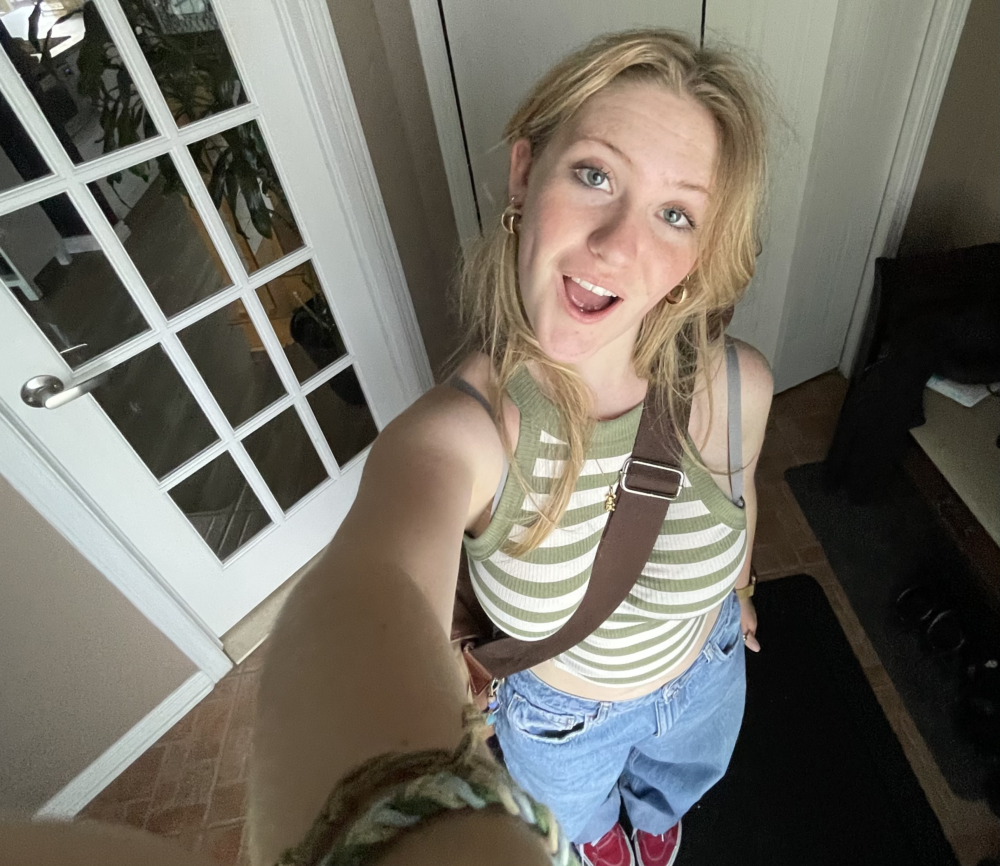

# Jade Hébert

## **Intérêts dans le multimédia**
J'aime bien la programmation et le web même si je comprends seulement la moitié de ce que je fais. Je ne sais pas, je trouve cela très satisfaisant. Mais je dirais que j'aime à peu près tout dans ce domaine (mise à part audio) et c'est vraiment pourquoi j'ai choisis cette technique; on explore différentes sphère du multimédia, tant plus logique comme la programmation, mais aussi technique, comme la photographie, tout en ajoutant de l'art et de l’originalité.

Sinon, j'aime énormément Star Wars (mais vraiment énormément), faire des playlists Spotify (je suis rendue à 63 playlists distinctes) et le café :)
